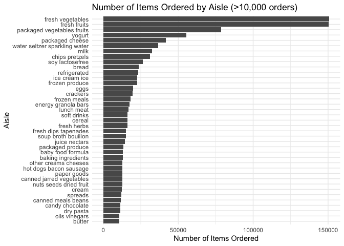

p8105_hw3_rk3445
================
Rosie Kwon

# Problem 1

``` r
library(tidyverse)
```

    ## ── Attaching core tidyverse packages ──────────────────────── tidyverse 2.0.0 ──
    ## ✔ dplyr     1.1.4     ✔ readr     2.1.5
    ## ✔ forcats   1.0.0     ✔ stringr   1.5.1
    ## ✔ ggplot2   3.5.2     ✔ tibble    3.3.0
    ## ✔ lubridate 1.9.4     ✔ tidyr     1.3.1
    ## ✔ purrr     1.1.0     
    ## ── Conflicts ────────────────────────────────────────── tidyverse_conflicts() ──
    ## ✖ dplyr::filter() masks stats::filter()
    ## ✖ dplyr::lag()    masks stats::lag()
    ## ℹ Use the conflicted package (<http://conflicted.r-lib.org/>) to force all conflicts to become errors

``` r
library(p8105.datasets)
data("instacart")
```

The `instacart` dataset provides item-level records of customer grocery
orders from the Instacart delivery service. This dataset contains
1384617 observations and 15 variables (columns).

Each row represents a single product within an order, the data includes
the name of the product (`product_name`), customer identifier
(`user_id`), the hour of the day on which the order was placed
(`order_hour_of_day`), aisle identifier (`aisle_id`), the recency of the
previous order (`days_since_prior_order`), an indication whether an item
is a `reordered` and etc.

``` r
instacart = instacart |> 
  janitor::clean_names() |> 
  mutate(
    order_dow_label = lubridate::wday(order_dow, label = TRUE, abbr = FALSE)
  )
```

For example, in the first row of the dataset:

- `user_id`: 112108  
- `order_id`: 1  
- `order_dow` : Wednesday
- `order_hour_of_day`: 10  
- `product_name`: Bulgarian Yogurt  
- `aisle`: yogurt

This shows that customer with id 112108 placed order 1 at 10 o’clock on
Wednesday and purchased Bulgarian Yogurt from the yogurt aisle.

#### How many aisles are there, and which aisles are the most items ordered from?

``` r
instacart |> 
  group_by(aisle) |> 
  summarise(count = n()) |> 
  arrange(desc(count))
```

    ## # A tibble: 134 × 2
    ##    aisle                          count
    ##    <chr>                          <int>
    ##  1 fresh vegetables              150609
    ##  2 fresh fruits                  150473
    ##  3 packaged vegetables fruits     78493
    ##  4 yogurt                         55240
    ##  5 packaged cheese                41699
    ##  6 water seltzer sparkling water  36617
    ##  7 milk                           32644
    ##  8 chips pretzels                 31269
    ##  9 soy lactosefree                26240
    ## 10 bread                          23635
    ## # ℹ 124 more rows

The total number of unique aisles in the instacart dataset is 134 and
the most items are ordered from fresh vegetables aisles.

#### Make a plot that shows the number of items ordered in each aisle, limiting this to aisles with more than 10000 items ordered. Arrange aisles sensibly, and organize your plot so others can read it.

``` r
instacart |> 
  group_by(aisle) |> 
  summarise(count = n()) |> 
  filter(count > 10000) |> 
  ggplot(aes(x = reorder(aisle, count), y = count)) +
  geom_col() +
  coord_flip() +
  labs(
    title = "Number of Items Ordered by Aisle (>10,000 orders)",
    x = "Aisle",
    y = "Number of Items Ordered"
  ) +
  theme_minimal()
```

<!-- -->

#### Make a table showing the three most popular items in each of the aisles “baking ingredients”, “dog food care”, and “packaged vegetables fruits”. Include the number of times each item is ordered in your table.

``` r
instacart |> 
  filter(
    aisle %in% c("baking ingredients", "dog food care", "packaged vegetables fruits")
    ) |>
  group_by(aisle, product_name) |> 
  summarize(n_items = n(), .groups = "drop") |> 
  arrange(aisle, desc(n_items)) |> 
  slice_max(n = 3, order_by = n_items, by = aisle) |>
  knitr::kable()
```

| aisle | product_name | n_items |
|:---|:---|---:|
| baking ingredients | Light Brown Sugar | 499 |
| baking ingredients | Pure Baking Soda | 387 |
| baking ingredients | Cane Sugar | 336 |
| dog food care | Snack Sticks Chicken & Rice Recipe Dog Treats | 30 |
| dog food care | Organix Chicken & Brown Rice Recipe | 28 |
| dog food care | Small Dog Biscuits | 26 |
| packaged vegetables fruits | Organic Baby Spinach | 9784 |
| packaged vegetables fruits | Organic Raspberries | 5546 |
| packaged vegetables fruits | Organic Blueberries | 4966 |

#### Make a table showing the mean hour of the day at which Pink Lady Apples and Coffee Ice Cream are ordered on each day of the week; format this table for human readers (i.e. produce a 2 x 7 table).

``` r
mean_hour = 
instacart |> 
  filter(product_name %in% c("Pink Lady Apples", "Coffee Ice Cream")) |> 
  group_by(product_name) |> 
  summarize(
    mean_hour = mean(order_hour_of_day, na.rm = TRUE)
  )
```
