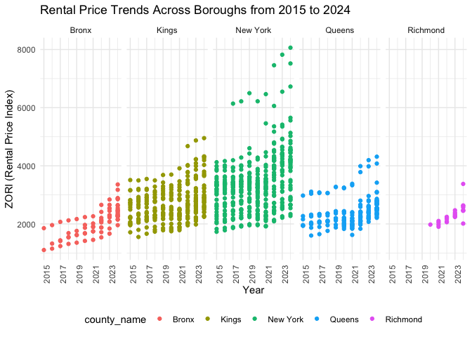
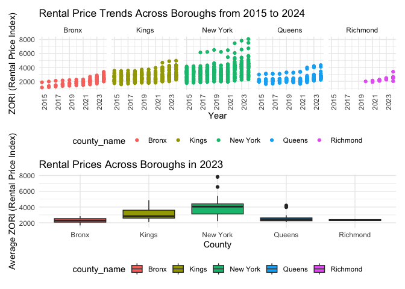

p8105_hw3_rk3445
================
Rosie Kwon

# Problem 1

``` r
library(tidyverse)
```

    ## ── Attaching core tidyverse packages ──────────────────────── tidyverse 2.0.0 ──
    ## ✔ dplyr     1.1.4     ✔ readr     2.1.5
    ## ✔ forcats   1.0.0     ✔ stringr   1.5.1
    ## ✔ ggplot2   3.5.2     ✔ tibble    3.3.0
    ## ✔ lubridate 1.9.4     ✔ tidyr     1.3.1
    ## ✔ purrr     1.1.0     
    ## ── Conflicts ────────────────────────────────────────── tidyverse_conflicts() ──
    ## ✖ dplyr::filter() masks stats::filter()
    ## ✖ dplyr::lag()    masks stats::lag()
    ## ℹ Use the conflicted package (<http://conflicted.r-lib.org/>) to force all conflicts to become errors

``` r
library(p8105.datasets)
data("instacart")
```

The `instacart` dataset provides item-level records of customer grocery
orders from the Instacart delivery service. This dataset contains
1384617 observations and 15 variables (columns), where each row
represents a single product within an order.

Key variables in the dataset are following:

``` r
user = instacart |> 
  janitor::clean_names() |> 
  group_by(user_id) |> 
  summarize(n_order = n()) |> 
  arrange(desc(n_order)) 
```

- `user_id` is used for identifying each customers in the dataset, there
  are 131209 distinct customers in the instacart, which enables to
  analyze behavior at the customer level. Both 149753 and 197541 ordered
  the most, with 80 orders each.

``` r
pop_product = instacart |> 
  janitor::clean_names() |> 
  group_by(product_name) |> 
  summarize(n_product = n()) |> 
  arrange(desc(n_product)) 
```

- `product_name` and `product_id` are for identifying the specific
  product purchased, having 39123 unique products in the dataset. The
  most popular product are Banana with 18726 orders , followed by Bag of
  Organic Bananas with 15480 orders.

- `aisle_id`, `aisle`, `department_id` and `department` are variables
  for identifying the location of products and enabling grouping
  products. The products are organized into 134 aisles and 21
  departments.

``` r
day_order = instacart |> 
  janitor::clean_names() |>
  mutate(
    order_dow_label = wday(order_dow + 1, label = TRUE, abbr = FALSE)
  ) |> 
  group_by(order_dow_label) |> 
  summarize(n_order = n())
```

- `order_dow`, `order_hour_of_day` indicate the time of orders from
  users. `days_since_prior_order` shows the how many days passed between
  orders with an average of 17.1 days. Those variables are used to see
  shopping habits of customers over time. `order_dow` is formatted in
  number so I created `order_dow_label` variable to easily notice the
  day of week. People usually buy their groceries on Sunday the most.

For example, in the first row of the dataset:

- `user_id`: 112108  
- `order_id`: 1  
- `order_hour_of_day` : 10
- `product_name`: Bulgarian Yogurt  
- `aisle`: yogurt

This shows that customer with id 112108 placed 1 order at 10 o’clock and
purchased Bulgarian Yogurt from the yogurt aisle.

**How many aisles are there, and which aisles are the most items ordered
from?**

``` r
instacart |> 
  group_by(aisle) |> 
  summarise(count = n()) |> 
  arrange(desc(count))
```

    ## # A tibble: 134 × 2
    ##    aisle                          count
    ##    <chr>                          <int>
    ##  1 fresh vegetables              150609
    ##  2 fresh fruits                  150473
    ##  3 packaged vegetables fruits     78493
    ##  4 yogurt                         55240
    ##  5 packaged cheese                41699
    ##  6 water seltzer sparkling water  36617
    ##  7 milk                           32644
    ##  8 chips pretzels                 31269
    ##  9 soy lactosefree                26240
    ## 10 bread                          23635
    ## # ℹ 124 more rows

The total number of unique aisles in the instacart dataset is 134 and
the most items are ordered from fresh vegetables aisle.

**Make a plot that shows the number of items ordered in each aisle,
limiting this to aisles with more than 10000 items ordered. Arrange
aisles sensibly, and organize your plot so others can read it.**

``` r
instacart |> 
  group_by(aisle) |> 
  summarise(count = n()) |> 
  filter(count > 10000) |> 
  ggplot(aes(x = reorder(aisle, count), y = count)) +
  geom_col() +
  coord_flip() +
  labs(
    title = "Number of Items Ordered by Aisle (>10,000)",
    x = "Aisle",
    y = "Number of Items Ordered"
  ) +
  theme_minimal(base_size = 13)
```

<!-- -->

**Make a table showing the three most popular items in each of the
aisles “baking ingredients”, “dog food care”, and “packaged vegetables
fruits”. Include the number of times each item is ordered in your
table.**

``` r
instacart |> 
  filter(
    aisle %in% c("baking ingredients", "dog food care", "packaged vegetables fruits")
    ) |>
  group_by(aisle, product_name) |> 
  summarize(n_items = n(), .groups = "drop") |> 
  arrange(aisle, desc(n_items)) |> 
  slice_max(n = 3, order_by = n_items, by = aisle) |>
  knitr::kable()
```

| aisle | product_name | n_items |
|:---|:---|---:|
| baking ingredients | Light Brown Sugar | 499 |
| baking ingredients | Pure Baking Soda | 387 |
| baking ingredients | Cane Sugar | 336 |
| dog food care | Snack Sticks Chicken & Rice Recipe Dog Treats | 30 |
| dog food care | Organix Chicken & Brown Rice Recipe | 28 |
| dog food care | Small Dog Biscuits | 26 |
| packaged vegetables fruits | Organic Baby Spinach | 9784 |
| packaged vegetables fruits | Organic Raspberries | 5546 |
| packaged vegetables fruits | Organic Blueberries | 4966 |

**Make a table showing the mean hour of the day at which Pink Lady
Apples and Coffee Ice Cream are ordered on each day of the week; format
this table for human readers (i.e. produce a 2 x 7 table).**

As `order_dow` variable has values from 0 to 6, I converted these
numbers into human-readable weekday names in variable `order_dow_label.`

``` r
instacart |> 
  filter(product_name %in% c("Pink Lady Apples", "Coffee Ice Cream")) |> 
  mutate(
    order_dow_label = wday(order_dow + 1, label = TRUE, abbr = FALSE)
  ) |> 
  group_by(product_name, order_dow_label) |> 
  summarize(
    mean_hour = round(mean(order_hour_of_day, na.rm = TRUE), digit = 2), 
    .groups = "drop"
  ) |> 
  pivot_wider(
    names_from = order_dow_label,
    values_from = mean_hour
  ) |> 
  knitr::kable()
```

| product_name     | Sunday | Monday | Tuesday | Wednesday | Thursday | Friday | Saturday |
|:-----------------|-------:|-------:|--------:|----------:|---------:|-------:|---------:|
| Coffee Ice Cream |  13.77 |  14.32 |   15.38 |     15.32 |    15.22 |  12.26 |    13.83 |
| Pink Lady Apples |  13.44 |  11.36 |   11.70 |     14.25 |    11.55 |  12.78 |    11.94 |

# Problem 2

**Import, clean, and tidy Zillow datasets ** Import, clean, tidy NYC
zipcode dataset

``` r
zipcode = 
  read_csv("data/Zip Codes.csv") |> 
  janitor::clean_names()
```

    ## Rows: 322 Columns: 7
    ## ── Column specification ────────────────────────────────────────────────────────
    ## Delimiter: ","
    ## chr (4): County, County Code, File Date, Neighborhood
    ## dbl (3): State FIPS, County FIPS, ZipCode
    ## 
    ## ℹ Use `spec()` to retrieve the full column specification for this data.
    ## ℹ Specify the column types or set `show_col_types = FALSE` to quiet this message.

Import, clean, tidy Zillow Observed Rent Index (ZORI) in New York City
dataset

``` r
zillow_nyc = 
  read_csv("data/Zip_zori_uc_sfrcondomfr_sm_month_NYC.csv") |> 
  janitor::clean_names() |>
  rename(
    zip_code = region_name
  ) |> 
  pivot_longer(
    x2015_01_31:x2024_08_31,
    names_to = "date",
    values_to = "zori",
    names_prefix = "x"
  ) |> 
  mutate(
    county_name = str_remove(county_name, " County$")
  ) 
```

    ## Rows: 149 Columns: 125
    ## ── Column specification ────────────────────────────────────────────────────────
    ## Delimiter: ","
    ## chr   (6): RegionType, StateName, State, City, Metro, CountyName
    ## dbl (119): RegionID, SizeRank, RegionName, 2015-01-31, 2015-02-28, 2015-03-3...
    ## 
    ## ℹ Use `spec()` to retrieve the full column specification for this data.
    ## ℹ Specify the column types or set `show_col_types = FALSE` to quiet this message.

**There are 116 months between January 2015 and August 2024. How many
ZIP codes are observed 116 times? How many are observed fewer than 10
times? Why are some ZIP codes are observed rarely and others observed in
each month?**

(Question! Should I use the merged data of zipcode and zillow_nyc to
consider the all the zipcodes instead of using only zillow dataset?)…!

``` r
zip_counts = zillow_nyc |> 
  drop_na(zori) |> 
  group_by(zip_code) |> 
  summarize(
    n_month = n()
  ) |> 
  filter(n_month < 10)
```

26 zipcodes are observed fewer than 10 times from January 2015 to August
2024. These zipcodes are rarely observed likely due to limited data or
missing/incomplete data. For example, some ZIP codes have more housing
units tracked by Zillow, others fewer. ZIP codes with very few units or
newly created ZIP codes may appear only rarely. Additionally, reporting
gaps can cause a month of data for certain ZIP codes to be missing.

**Create a table showing the average rental price in each borough and
year (not month). Comment on trends in this table.**

``` r
zillow_nyc |> 
  mutate(year = str_sub(date, 1, 4)) |> 
  group_by(county_name, year) |> 
  summarize(
    avg_rental_price = mean(zori, na.rm = TRUE)
  ) |> 
  knitr::kable(
    digits = 0,
    caption = "Average Rental Price (ZORI) by NYC counties and Year",
    col.names = c("Borough (County)", "Year", "Average ZORI")
  )
```

    ## `summarise()` has grouped output by 'county_name'. You can override using the
    ## `.groups` argument.

| Borough (County) | Year | Average ZORI |
|:-----------------|:-----|-------------:|
| Bronx            | 2015 |         1760 |
| Bronx            | 2016 |         1520 |
| Bronx            | 2017 |         1544 |
| Bronx            | 2018 |         1639 |
| Bronx            | 2019 |         1706 |
| Bronx            | 2020 |         1811 |
| Bronx            | 2021 |         1858 |
| Bronx            | 2022 |         2054 |
| Bronx            | 2023 |         2285 |
| Bronx            | 2024 |         2497 |
| Kings            | 2015 |         2493 |
| Kings            | 2016 |         2520 |
| Kings            | 2017 |         2546 |
| Kings            | 2018 |         2547 |
| Kings            | 2019 |         2631 |
| Kings            | 2020 |         2555 |
| Kings            | 2021 |         2550 |
| Kings            | 2022 |         2868 |
| Kings            | 2023 |         3015 |
| Kings            | 2024 |         3127 |
| New York         | 2015 |         3022 |
| New York         | 2016 |         3039 |
| New York         | 2017 |         3134 |
| New York         | 2018 |         3184 |
| New York         | 2019 |         3310 |
| New York         | 2020 |         3107 |
| New York         | 2021 |         3137 |
| New York         | 2022 |         3778 |
| New York         | 2023 |         3933 |
| New York         | 2024 |         4078 |
| Queens           | 2015 |         2215 |
| Queens           | 2016 |         2272 |
| Queens           | 2017 |         2263 |
| Queens           | 2018 |         2292 |
| Queens           | 2019 |         2388 |
| Queens           | 2020 |         2316 |
| Queens           | 2021 |         2211 |
| Queens           | 2022 |         2406 |
| Queens           | 2023 |         2562 |
| Queens           | 2024 |         2694 |
| Richmond         | 2015 |          NaN |
| Richmond         | 2016 |          NaN |
| Richmond         | 2017 |          NaN |
| Richmond         | 2018 |          NaN |
| Richmond         | 2019 |          NaN |
| Richmond         | 2020 |         1978 |
| Richmond         | 2021 |         2045 |
| Richmond         | 2022 |         2147 |
| Richmond         | 2023 |         2333 |
| Richmond         | 2024 |         2536 |

Average Rental Price (ZORI) by NYC counties and Year

From the table, we can see the upward trend in rental prices over time
for all boroughs in New York City. However, in 2021, both Kings and
Queens has dropped compared to year of 2020. This was mainly due to the
COVID-19 pandemic. By 2022 and 2023, prices in all boroughs, including
Kings and Queens, rebounded sharply, surpassing pre-pandemic price.

**Make a plot showing NYC Rental Prices within ZIP codes for all
available years. Your plot should facilitate comparisons across
boroughs. Comment on any significant elements of this plot.**

``` r
zillow_nyc |> 
  mutate(year = str_sub(date, 1, 4)) |>  
  ggplot(aes(x = year, y = zori, color = county_name)) +
  geom_point(alpha = .3) +
  geom_smooth() +
  labs(
    title = "NYC Rental Prices (ZORI) Across ZIP Codes Over Time",
    x = "Year",
    y = "ZORI (Rental Price Index)",
    color = "County"
  ) 
```

    ## `geom_smooth()` using method = 'loess' and formula = 'y ~ x'

    ## Warning: Removed 6834 rows containing non-finite outside the scale range
    ## (`stat_smooth()`).

    ## Warning: Removed 6834 rows containing missing values or values outside the scale range
    ## (`geom_point()`).

<!-- -->

``` r
zillow_nyc %>% 
  mutate(year = str_sub(date, 1, 4)) %>%
  group_by(county_name, year) %>%
  summarize(avg_zori = mean(zori, na.rm = TRUE)) %>%
  ggplot(aes(x = year, y = avg_zori, color = county_name)) +
  geom_line(size = 1) +
  geom_point() +
  labs(
    title = "Average Rental Price Trends Across NYC Boroughs",
    x = "Year",
    y = "Average ZORI",
    color = "Borough"
  ) +
  theme_minimal()
```

    ## `summarise()` has grouped output by 'county_name'. You can override using the
    ## `.groups` argument.

    ## Warning: Using `size` aesthetic for lines was deprecated in ggplot2 3.4.0.
    ## ℹ Please use `linewidth` instead.
    ## This warning is displayed once every 8 hours.
    ## Call `lifecycle::last_lifecycle_warnings()` to see where this warning was
    ## generated.

    ## Warning: Removed 5 rows containing missing values or values outside the scale range
    ## (`geom_line()`).

    ## `geom_line()`: Each group consists of only one observation.
    ## ℹ Do you need to adjust the group aesthetic?

    ## Warning: Removed 5 rows containing missing values or values outside the scale range
    ## (`geom_point()`).

<!-- -->

``` r
zillow_nyc |> 
  mutate(year = str_sub(date, 1, 4)) |> 
  ggplot(aes(x = year, y = zori, color = county_name)) +
  geom_point(alpha = 0.4) +
  geom_smooth(se = FALSE) + 
  facet_grid(. ~ county_name) +
  labs(
    title = "Distribution of Rental Prices by Borough and Year",
    x = "Year",
    y = "ZORI (Rental Price Index)",
    fill = "County"
  ) +
  theme_minimal()
```

    ## `geom_smooth()` using method = 'loess' and formula = 'y ~ x'

    ## Warning: Removed 6834 rows containing non-finite outside the scale range
    ## (`stat_smooth()`).

    ## Warning: Removed 6834 rows containing missing values or values outside the scale range
    ## (`geom_point()`).

<!-- -->

``` r
zillow_nyc %>% 
  mutate(year = as.numeric(str_sub(date, 1, 4))) %>%  
  ggplot(aes(x = year, y = zori, color = county_name)) +
  geom_point(alpha = 0.2, size = 0.7) +   # ZIP-level points
  geom_smooth(se = FALSE, size = 1.2) +  # Borough trend highlight
  labs(
    title = "NYC Rental Prices Within ZIP Codes Over Time",
    subtitle = "ZIP-level data with borough-level trend lines",
    x = "Year",
    y = "ZORI (Rental Price Index)",
    color = "Borough"
  ) +
  theme_minimal()
```

    ## `geom_smooth()` using method = 'gam' and formula = 'y ~ s(x, bs = "cs")'

    ## Warning: Removed 6834 rows containing non-finite outside the scale range
    ## (`stat_smooth()`).

    ## Warning: Failed to fit group 5.
    ## Caused by error in `smooth.construct.cr.smooth.spec()`:
    ## ! x has insufficient unique values to support 10 knots: reduce k.

    ## Warning: Removed 6834 rows containing missing values or values outside the scale range
    ## (`geom_point()`).

<!-- -->

``` r
zillow_nyc |> 
  mutate(year = as.integer(str_sub(date, 1, 4)))  |> 
  group_by(zip_code, county_name, year) |> 
  summarize(avg_zori = mean(zori, na.rm = TRUE), .groups = "drop") |> 
  ggplot(aes(x = year, y = avg_zori, group = zip_code, color = county_name)) +
  geom_line(alpha = 0.15) +
  stat_summary(
    aes(group = county_name), fun = mean, geom = "line", size = 1.5, alpha = 0.9
  ) +
  labs(
    title = "ZIP-Level Rental Price Trends with Borough Averages",
    subtitle = "Thin lines = individual ZIP codes, Thick lines = county-wide trend",
    x = "Year",
    y = "ZORI (Rental Price Index)",
    color = "County"
  ) + 
  scale_x_continuous(
    breaks = c(2015, 2017, 2019, 2021, 2023),
    labels = c("2015", "2017", "2019", "2021", "2023")
  ) +
  theme_minimal()
```

    ## Warning: Removed 531 rows containing non-finite outside the scale range
    ## (`stat_summary()`).

    ## Warning: Removed 531 rows containing missing values or values outside the scale range
    ## (`geom_line()`).

<!-- -->

Compute the average rental price within each ZIP code over each month in
2023. Make a reader-friendly plot showing the distribution of
ZIP-code-level rental prices across boroughs; put differently, your plot
should facilitate the comparison of the distribution of average rental
prices across boroughs. Comment on this plot.

Combine the two previous plots into a single graphic, and export this to
a results folder in your repository.
