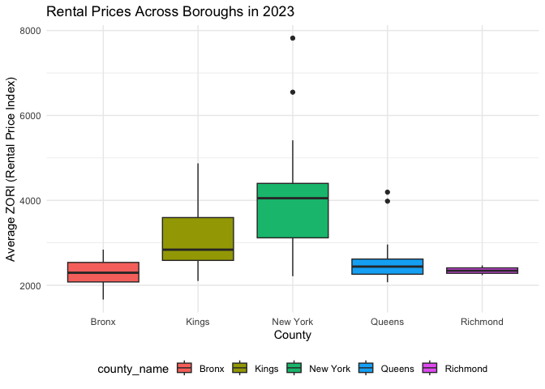

p8105_hw3_rk3445
================
Rosie Kwon

``` r
library(tidyverse)
```

    ## ── Attaching core tidyverse packages ──────────────────────── tidyverse 2.0.0 ──
    ## ✔ dplyr     1.1.4     ✔ readr     2.1.5
    ## ✔ forcats   1.0.0     ✔ stringr   1.5.1
    ## ✔ ggplot2   3.5.2     ✔ tibble    3.3.0
    ## ✔ lubridate 1.9.4     ✔ tidyr     1.3.1
    ## ✔ purrr     1.1.0     
    ## ── Conflicts ────────────────────────────────────────── tidyverse_conflicts() ──
    ## ✖ dplyr::filter() masks stats::filter()
    ## ✖ dplyr::lag()    masks stats::lag()
    ## ℹ Use the conflicted package (<http://conflicted.r-lib.org/>) to force all conflicts to become errors

``` r
library(patchwork)
```

# Problem 1

``` r
library(p8105.datasets)
data("instacart")
```

The `instacart` dataset provides item-level records of customer grocery
orders from the Instacart delivery service. This dataset contains
1384617 observations and 15 variables (columns), where each row
represents a single product within an order.

Key variables in the dataset are following:

``` r
user = 
  instacart |> 
  janitor::clean_names() |> 
  group_by(user_id) |> 
  summarize(n_order = n()) |> 
  arrange(desc(n_order)) 
```

- `user_id` is used for identifying each customers in the dataset, there
  are 131209 distinct customers in the instacart, which enables to
  analyze behavior at the customer level. Both 149753 and 197541 ordered
  the most, with 80 orders each.

``` r
pop_product = 
  instacart |> 
  janitor::clean_names() |> 
  group_by(product_name) |> 
  summarize(n_product = n()) |> 
  arrange(desc(n_product)) 
```

- `product_name` and `product_id` are for identifying the specific
  product purchased, having 39123 unique products in the dataset. The
  most popular product are Banana with 18726 orders , followed by Bag of
  Organic Bananas with 15480 orders.

- `aisle_id`, `aisle`, `department_id` and `department` are variables
  for identifying the location of products and enabling grouping
  products. The products are organized into 134 aisles and 21
  departments.

``` r
day_order = 
  instacart |> 
  janitor::clean_names() |>
  mutate(
    order_dow_label = wday(order_dow + 1, label = TRUE, abbr = FALSE)
  ) |> 
  group_by(order_dow_label) |> 
  summarize(n_order = n())
```

- `order_dow`, `order_hour_of_day` indicate the time of orders from
  users. `days_since_prior_order` shows the how many days passed between
  orders with an average of 17.1 days. Those variables are used to see
  shopping habits of customers over time. `order_dow` is formatted in
  number so I created `order_dow_label` variable to easily notice the
  day of week. People usually buy their groceries on Sunday the most.

For example, in the first row of the dataset:

- `user_id`: 112108  
- `order_id`: 1  
- `order_hour_of_day` : 10
- `product_name`: Bulgarian Yogurt  
- `aisle`: yogurt

This shows that customer with id 112108 placed 1 order at 10 o’clock and
purchased Bulgarian Yogurt from the yogurt aisle.

**How many aisles are there, and which aisles are the most items ordered
from?**

``` r
instacart |> 
  group_by(aisle) |> 
  summarise(count = n()) |> 
  arrange(desc(count))
```

    ## # A tibble: 134 × 2
    ##    aisle                          count
    ##    <chr>                          <int>
    ##  1 fresh vegetables              150609
    ##  2 fresh fruits                  150473
    ##  3 packaged vegetables fruits     78493
    ##  4 yogurt                         55240
    ##  5 packaged cheese                41699
    ##  6 water seltzer sparkling water  36617
    ##  7 milk                           32644
    ##  8 chips pretzels                 31269
    ##  9 soy lactosefree                26240
    ## 10 bread                          23635
    ## # ℹ 124 more rows

The total number of unique aisles in the instacart dataset is 134 and
the most items are ordered from fresh vegetables aisle.

**Make a plot that shows the number of items ordered in each aisle,
limiting this to aisles with more than 10000 items ordered. Arrange
aisles sensibly, and organize your plot so others can read it.**

``` r
instacart |> 
  group_by(aisle) |> 
  summarise(count = n()) |> 
  filter(count > 10000) |> 
  ggplot(aes(x = reorder(aisle, count), y = count)) +
  geom_col() +
  coord_flip() +
  labs(
    title = "Number of Items Ordered by Aisle (>10,000)",
    x = "Aisle",
    y = "Number of Items Ordered"
  ) +
  theme_minimal(base_size = 13)
```

<!-- -->

**Make a table showing the three most popular items in each of the
aisles “baking ingredients”, “dog food care”, and “packaged vegetables
fruits”. Include the number of times each item is ordered in your
table.**

``` r
instacart |> 
  filter(
    aisle %in% c("baking ingredients", "dog food care", "packaged vegetables fruits")
    ) |>
  group_by(aisle, product_name) |> 
  summarize(n_items = n(), .groups = "drop") |> 
  arrange(aisle, desc(n_items)) |> 
  slice_max(n = 3, order_by = n_items, by = aisle) |>
  knitr::kable()
```

| aisle | product_name | n_items |
|:---|:---|---:|
| baking ingredients | Light Brown Sugar | 499 |
| baking ingredients | Pure Baking Soda | 387 |
| baking ingredients | Cane Sugar | 336 |
| dog food care | Snack Sticks Chicken & Rice Recipe Dog Treats | 30 |
| dog food care | Organix Chicken & Brown Rice Recipe | 28 |
| dog food care | Small Dog Biscuits | 26 |
| packaged vegetables fruits | Organic Baby Spinach | 9784 |
| packaged vegetables fruits | Organic Raspberries | 5546 |
| packaged vegetables fruits | Organic Blueberries | 4966 |

**Make a table showing the mean hour of the day at which Pink Lady
Apples and Coffee Ice Cream are ordered on each day of the week; format
this table for human readers (i.e. produce a 2 x 7 table).**

As `order_dow` variable has values from 0 to 6, I converted these
numbers into human-readable weekday names in variable `order_dow_label.`

``` r
instacart |> 
  filter(product_name %in% c("Pink Lady Apples", "Coffee Ice Cream")) |> 
  mutate(
    order_dow_label = wday(order_dow + 1, label = TRUE, abbr = FALSE)
  ) |> 
  group_by(product_name, order_dow_label) |> 
  summarize(
    mean_hour = round(mean(order_hour_of_day, na.rm = TRUE), digit = 2), 
    .groups = "drop"
  ) |> 
  pivot_wider(
    names_from = order_dow_label,
    values_from = mean_hour
  ) |> 
  knitr::kable()
```

| product_name     | Sunday | Monday | Tuesday | Wednesday | Thursday | Friday | Saturday |
|:-----------------|-------:|-------:|--------:|----------:|---------:|-------:|---------:|
| Coffee Ice Cream |  13.77 |  14.32 |   15.38 |     15.32 |    15.22 |  12.26 |    13.83 |
| Pink Lady Apples |  13.44 |  11.36 |   11.70 |     14.25 |    11.55 |  12.78 |    11.94 |

# Problem 2

**Import, clean, and tidy Zillow datasets ** Import, clean, tidy NYC
zipcode dataset

``` r
zipcode = 
  read_csv("data/Zip Codes.csv") |> 
  janitor::clean_names()
```

    ## Rows: 322 Columns: 7
    ## ── Column specification ────────────────────────────────────────────────────────
    ## Delimiter: ","
    ## chr (4): County, County Code, File Date, Neighborhood
    ## dbl (3): State FIPS, County FIPS, ZipCode
    ## 
    ## ℹ Use `spec()` to retrieve the full column specification for this data.
    ## ℹ Specify the column types or set `show_col_types = FALSE` to quiet this message.

Import, clean, tidy Zillow Observed Rent Index (ZORI) in New York City
dataset

``` r
zillow_nyc = 
  read_csv("data/Zip_zori_uc_sfrcondomfr_sm_month_NYC.csv") |> 
  janitor::clean_names() |>
  rename(
    zip_code = region_name
  ) |> 
  pivot_longer(
    x2015_01_31:x2024_08_31,
    names_to = "date",
    values_to = "zori",
    names_prefix = "x"
  ) |> 
  mutate(
    county_name = str_remove(county_name, " County$")
  ) 
```

    ## Rows: 149 Columns: 125
    ## ── Column specification ────────────────────────────────────────────────────────
    ## Delimiter: ","
    ## chr   (6): RegionType, StateName, State, City, Metro, CountyName
    ## dbl (119): RegionID, SizeRank, RegionName, 2015-01-31, 2015-02-28, 2015-03-3...
    ## 
    ## ℹ Use `spec()` to retrieve the full column specification for this data.
    ## ℹ Specify the column types or set `show_col_types = FALSE` to quiet this message.

**There are 116 months between January 2015 and August 2024. How many
ZIP codes are observed 116 times? How many are observed fewer than 10
times? Why are some ZIP codes are observed rarely and others observed in
each month?**

(Question! Should I use the merged data of zipcode and zillow_nyc to
consider the all the zipcodes instead of using only zillow dataset?)…!

``` r
zip_counts = 
  zillow_nyc |> 
  drop_na(zori) |> 
  group_by(zip_code) |> 
  summarize(
    n_month = n()
  ) |> 
  filter(n_month < 10)
```

26 zipcodes are observed fewer than 10 times from January 2015 to August
2024. These zipcodes are rarely observed likely due to limited data or
missing/incomplete data. For example, some ZIP codes have more housing
units tracked by Zillow, others fewer. ZIP codes with very few units or
newly created ZIP codes may appear only rarely. Additionally, reporting
gaps can cause a month of data for certain ZIP codes to be missing.

**Create a table showing the average rental price in each borough and
year (not month). Comment on trends in this table.**

``` r
zillow_nyc |> 
  mutate(year = str_sub(date, 1, 4)) |> 
  group_by(county_name, year) |> 
  summarize(
    avg_rental_price = mean(zori, na.rm = TRUE)
  ) |> 
  knitr::kable(
    digits = 0,
    caption = "Average Rental Price (ZORI) by NYC counties and Year",
    col.names = c("Borough (County)", "Year", "Average ZORI")
  )
```

    ## `summarise()` has grouped output by 'county_name'. You can override using the
    ## `.groups` argument.

| Borough (County) | Year | Average ZORI |
|:-----------------|:-----|-------------:|
| Bronx            | 2015 |         1760 |
| Bronx            | 2016 |         1520 |
| Bronx            | 2017 |         1544 |
| Bronx            | 2018 |         1639 |
| Bronx            | 2019 |         1706 |
| Bronx            | 2020 |         1811 |
| Bronx            | 2021 |         1858 |
| Bronx            | 2022 |         2054 |
| Bronx            | 2023 |         2285 |
| Bronx            | 2024 |         2497 |
| Kings            | 2015 |         2493 |
| Kings            | 2016 |         2520 |
| Kings            | 2017 |         2546 |
| Kings            | 2018 |         2547 |
| Kings            | 2019 |         2631 |
| Kings            | 2020 |         2555 |
| Kings            | 2021 |         2550 |
| Kings            | 2022 |         2868 |
| Kings            | 2023 |         3015 |
| Kings            | 2024 |         3127 |
| New York         | 2015 |         3022 |
| New York         | 2016 |         3039 |
| New York         | 2017 |         3134 |
| New York         | 2018 |         3184 |
| New York         | 2019 |         3310 |
| New York         | 2020 |         3107 |
| New York         | 2021 |         3137 |
| New York         | 2022 |         3778 |
| New York         | 2023 |         3933 |
| New York         | 2024 |         4078 |
| Queens           | 2015 |         2215 |
| Queens           | 2016 |         2272 |
| Queens           | 2017 |         2263 |
| Queens           | 2018 |         2292 |
| Queens           | 2019 |         2388 |
| Queens           | 2020 |         2316 |
| Queens           | 2021 |         2211 |
| Queens           | 2022 |         2406 |
| Queens           | 2023 |         2562 |
| Queens           | 2024 |         2694 |
| Richmond         | 2015 |          NaN |
| Richmond         | 2016 |          NaN |
| Richmond         | 2017 |          NaN |
| Richmond         | 2018 |          NaN |
| Richmond         | 2019 |          NaN |
| Richmond         | 2020 |         1978 |
| Richmond         | 2021 |         2045 |
| Richmond         | 2022 |         2147 |
| Richmond         | 2023 |         2333 |
| Richmond         | 2024 |         2536 |

Average Rental Price (ZORI) by NYC counties and Year

From the table, we can see the upward trend in rental prices over time
for all boroughs in New York City. However, in 2021, both Kings and
Queens has dropped compared to year of 2020. This was mainly due to the
COVID-19 pandemic. By 2022 and 2023, prices in all boroughs, including
Kings and Queens, rebounded sharply, surpassing pre-pandemic price.

**Make a plot showing NYC Rental Prices within ZIP codes for all
available years. Your plot should facilitate comparisons across
boroughs. Comment on any significant elements of this plot.**

``` r
rental_allyear = 
  zillow_nyc |> 
  mutate(year = as.integer(str_sub(date, 1, 4)))  |> 
  group_by(zip_code, county_name, year) |> 
  summarize(avg_zori = mean(zori, na.rm = TRUE), .groups = "drop") |> 
  ggplot(aes(x = year, y = avg_zori, group = zip_code, color = county_name)) +
  geom_line(alpha = 0.15) +
  stat_summary(
    aes(group = county_name), fun = mean, geom = "line", size = 1.5, alpha = 0.9
  ) +
  labs(
    title = "Rental Price Trends Across Boroughs from 2015 to 2024",
    subtitle = "Thin lines = individual ZIP codes, Thick lines = county-wide trend",
    x = "Year",
    y = "ZORI (Rental Price Index)",
    color = "County"
  ) + 
  scale_x_continuous(
    breaks = c(2015, 2017, 2019, 2021, 2023),
    labels = c("2015", "2017", "2019", "2021", "2023")
  ) +
  theme_minimal() +
  theme(legend.position = "bottom") 
```

    ## Warning: Using `size` aesthetic for lines was deprecated in ggplot2 3.4.0.
    ## ℹ Please use `linewidth` instead.
    ## This warning is displayed once every 8 hours.
    ## Call `lifecycle::last_lifecycle_warnings()` to see where this warning was
    ## generated.

This plot shows rental price trends in New York City across ZIP codes
and counties from 2015 to 2024. Only Richmond county has a record from
2020 to 2024. The Zillow Observed Rent Index (ZORI) has a steady upward
trend, with a noticeable acceleration after 2021. The thin lines
indicate individual ZIP codes, showing substantial within-county
variation. New York county has the widest spread upuntil 8000 ZORI and
it stands out with the highest rent levels among five counties and the
steepest increase from 2021 to 2022.

**Compute the average rental price within each ZIP code over each month
in 2023. Make a reader-friendly plot showing the distribution of
ZIP-code-level rental prices across boroughs; put differently, your plot
should facilitate the comparison of the distribution of average rental
prices across boroughs. Comment on this plot.**

!! question! The question says over each month but the zillow data
already provides the monthly based rental price for each zip code. Does
it mean that we need to compute the average over 2023?

``` r
rental_2023 = 
  zillow_nyc |> 
  separate(
    date, into = c("year", "month", "day")
  )  |> 
  filter(year == 2023) |> 
  group_by(zip_code, county_name) |> 
  summarize(avg_zori = mean(zori)) |> 
  ggplot(aes(x = county_name, y = avg_zori)) +
  geom_boxplot() +
  labs(
    title = "Rental Prices Across Boroughs in 2023",    
    x = "County",
    y = "Average ZORI (Rental Price Index)"
    
  )
```

    ## `summarise()` has grouped output by 'zip_code'. You can override using the
    ## `.groups` argument.

``` r
  theme_minimal() 
```

    ## List of 136
    ##  $ line                            :List of 6
    ##   ..$ colour       : chr "black"
    ##   ..$ linewidth    : num 0.5
    ##   ..$ linetype     : num 1
    ##   ..$ lineend      : chr "butt"
    ##   ..$ arrow        : logi FALSE
    ##   ..$ inherit.blank: logi TRUE
    ##   ..- attr(*, "class")= chr [1:2] "element_line" "element"
    ##  $ rect                            :List of 5
    ##   ..$ fill         : chr "white"
    ##   ..$ colour       : chr "black"
    ##   ..$ linewidth    : num 0.5
    ##   ..$ linetype     : num 1
    ##   ..$ inherit.blank: logi TRUE
    ##   ..- attr(*, "class")= chr [1:2] "element_rect" "element"
    ##  $ text                            :List of 11
    ##   ..$ family       : chr ""
    ##   ..$ face         : chr "plain"
    ##   ..$ colour       : chr "black"
    ##   ..$ size         : num 11
    ##   ..$ hjust        : num 0.5
    ##   ..$ vjust        : num 0.5
    ##   ..$ angle        : num 0
    ##   ..$ lineheight   : num 0.9
    ##   ..$ margin       : 'margin' num [1:4] 0points 0points 0points 0points
    ##   .. ..- attr(*, "unit")= int 8
    ##   ..$ debug        : logi FALSE
    ##   ..$ inherit.blank: logi TRUE
    ##   ..- attr(*, "class")= chr [1:2] "element_text" "element"
    ##  $ title                           : NULL
    ##  $ aspect.ratio                    : NULL
    ##  $ axis.title                      : NULL
    ##  $ axis.title.x                    :List of 11
    ##   ..$ family       : NULL
    ##   ..$ face         : NULL
    ##   ..$ colour       : NULL
    ##   ..$ size         : NULL
    ##   ..$ hjust        : NULL
    ##   ..$ vjust        : num 1
    ##   ..$ angle        : NULL
    ##   ..$ lineheight   : NULL
    ##   ..$ margin       : 'margin' num [1:4] 2.75points 0points 0points 0points
    ##   .. ..- attr(*, "unit")= int 8
    ##   ..$ debug        : NULL
    ##   ..$ inherit.blank: logi TRUE
    ##   ..- attr(*, "class")= chr [1:2] "element_text" "element"
    ##  $ axis.title.x.top                :List of 11
    ##   ..$ family       : NULL
    ##   ..$ face         : NULL
    ##   ..$ colour       : NULL
    ##   ..$ size         : NULL
    ##   ..$ hjust        : NULL
    ##   ..$ vjust        : num 0
    ##   ..$ angle        : NULL
    ##   ..$ lineheight   : NULL
    ##   ..$ margin       : 'margin' num [1:4] 0points 0points 2.75points 0points
    ##   .. ..- attr(*, "unit")= int 8
    ##   ..$ debug        : NULL
    ##   ..$ inherit.blank: logi TRUE
    ##   ..- attr(*, "class")= chr [1:2] "element_text" "element"
    ##  $ axis.title.x.bottom             : NULL
    ##  $ axis.title.y                    :List of 11
    ##   ..$ family       : NULL
    ##   ..$ face         : NULL
    ##   ..$ colour       : NULL
    ##   ..$ size         : NULL
    ##   ..$ hjust        : NULL
    ##   ..$ vjust        : num 1
    ##   ..$ angle        : num 90
    ##   ..$ lineheight   : NULL
    ##   ..$ margin       : 'margin' num [1:4] 0points 2.75points 0points 0points
    ##   .. ..- attr(*, "unit")= int 8
    ##   ..$ debug        : NULL
    ##   ..$ inherit.blank: logi TRUE
    ##   ..- attr(*, "class")= chr [1:2] "element_text" "element"
    ##  $ axis.title.y.left               : NULL
    ##  $ axis.title.y.right              :List of 11
    ##   ..$ family       : NULL
    ##   ..$ face         : NULL
    ##   ..$ colour       : NULL
    ##   ..$ size         : NULL
    ##   ..$ hjust        : NULL
    ##   ..$ vjust        : num 1
    ##   ..$ angle        : num -90
    ##   ..$ lineheight   : NULL
    ##   ..$ margin       : 'margin' num [1:4] 0points 0points 0points 2.75points
    ##   .. ..- attr(*, "unit")= int 8
    ##   ..$ debug        : NULL
    ##   ..$ inherit.blank: logi TRUE
    ##   ..- attr(*, "class")= chr [1:2] "element_text" "element"
    ##  $ axis.text                       :List of 11
    ##   ..$ family       : NULL
    ##   ..$ face         : NULL
    ##   ..$ colour       : chr "grey30"
    ##   ..$ size         : 'rel' num 0.8
    ##   ..$ hjust        : NULL
    ##   ..$ vjust        : NULL
    ##   ..$ angle        : NULL
    ##   ..$ lineheight   : NULL
    ##   ..$ margin       : NULL
    ##   ..$ debug        : NULL
    ##   ..$ inherit.blank: logi TRUE
    ##   ..- attr(*, "class")= chr [1:2] "element_text" "element"
    ##  $ axis.text.x                     :List of 11
    ##   ..$ family       : NULL
    ##   ..$ face         : NULL
    ##   ..$ colour       : NULL
    ##   ..$ size         : NULL
    ##   ..$ hjust        : NULL
    ##   ..$ vjust        : num 1
    ##   ..$ angle        : NULL
    ##   ..$ lineheight   : NULL
    ##   ..$ margin       : 'margin' num [1:4] 2.2points 0points 0points 0points
    ##   .. ..- attr(*, "unit")= int 8
    ##   ..$ debug        : NULL
    ##   ..$ inherit.blank: logi TRUE
    ##   ..- attr(*, "class")= chr [1:2] "element_text" "element"
    ##  $ axis.text.x.top                 :List of 11
    ##   ..$ family       : NULL
    ##   ..$ face         : NULL
    ##   ..$ colour       : NULL
    ##   ..$ size         : NULL
    ##   ..$ hjust        : NULL
    ##   ..$ vjust        : num 0
    ##   ..$ angle        : NULL
    ##   ..$ lineheight   : NULL
    ##   ..$ margin       : 'margin' num [1:4] 0points 0points 2.2points 0points
    ##   .. ..- attr(*, "unit")= int 8
    ##   ..$ debug        : NULL
    ##   ..$ inherit.blank: logi TRUE
    ##   ..- attr(*, "class")= chr [1:2] "element_text" "element"
    ##  $ axis.text.x.bottom              : NULL
    ##  $ axis.text.y                     :List of 11
    ##   ..$ family       : NULL
    ##   ..$ face         : NULL
    ##   ..$ colour       : NULL
    ##   ..$ size         : NULL
    ##   ..$ hjust        : num 1
    ##   ..$ vjust        : NULL
    ##   ..$ angle        : NULL
    ##   ..$ lineheight   : NULL
    ##   ..$ margin       : 'margin' num [1:4] 0points 2.2points 0points 0points
    ##   .. ..- attr(*, "unit")= int 8
    ##   ..$ debug        : NULL
    ##   ..$ inherit.blank: logi TRUE
    ##   ..- attr(*, "class")= chr [1:2] "element_text" "element"
    ##  $ axis.text.y.left                : NULL
    ##  $ axis.text.y.right               :List of 11
    ##   ..$ family       : NULL
    ##   ..$ face         : NULL
    ##   ..$ colour       : NULL
    ##   ..$ size         : NULL
    ##   ..$ hjust        : num 0
    ##   ..$ vjust        : NULL
    ##   ..$ angle        : NULL
    ##   ..$ lineheight   : NULL
    ##   ..$ margin       : 'margin' num [1:4] 0points 0points 0points 2.2points
    ##   .. ..- attr(*, "unit")= int 8
    ##   ..$ debug        : NULL
    ##   ..$ inherit.blank: logi TRUE
    ##   ..- attr(*, "class")= chr [1:2] "element_text" "element"
    ##  $ axis.text.theta                 : NULL
    ##  $ axis.text.r                     :List of 11
    ##   ..$ family       : NULL
    ##   ..$ face         : NULL
    ##   ..$ colour       : NULL
    ##   ..$ size         : NULL
    ##   ..$ hjust        : num 0.5
    ##   ..$ vjust        : NULL
    ##   ..$ angle        : NULL
    ##   ..$ lineheight   : NULL
    ##   ..$ margin       : 'margin' num [1:4] 0points 2.2points 0points 2.2points
    ##   .. ..- attr(*, "unit")= int 8
    ##   ..$ debug        : NULL
    ##   ..$ inherit.blank: logi TRUE
    ##   ..- attr(*, "class")= chr [1:2] "element_text" "element"
    ##  $ axis.ticks                      : list()
    ##   ..- attr(*, "class")= chr [1:2] "element_blank" "element"
    ##  $ axis.ticks.x                    : NULL
    ##  $ axis.ticks.x.top                : NULL
    ##  $ axis.ticks.x.bottom             : NULL
    ##  $ axis.ticks.y                    : NULL
    ##  $ axis.ticks.y.left               : NULL
    ##  $ axis.ticks.y.right              : NULL
    ##  $ axis.ticks.theta                : NULL
    ##  $ axis.ticks.r                    : NULL
    ##  $ axis.minor.ticks.x.top          : NULL
    ##  $ axis.minor.ticks.x.bottom       : NULL
    ##  $ axis.minor.ticks.y.left         : NULL
    ##  $ axis.minor.ticks.y.right        : NULL
    ##  $ axis.minor.ticks.theta          : NULL
    ##  $ axis.minor.ticks.r              : NULL
    ##  $ axis.ticks.length               : 'simpleUnit' num 2.75points
    ##   ..- attr(*, "unit")= int 8
    ##  $ axis.ticks.length.x             : NULL
    ##  $ axis.ticks.length.x.top         : NULL
    ##  $ axis.ticks.length.x.bottom      : NULL
    ##  $ axis.ticks.length.y             : NULL
    ##  $ axis.ticks.length.y.left        : NULL
    ##  $ axis.ticks.length.y.right       : NULL
    ##  $ axis.ticks.length.theta         : NULL
    ##  $ axis.ticks.length.r             : NULL
    ##  $ axis.minor.ticks.length         : 'rel' num 0.75
    ##  $ axis.minor.ticks.length.x       : NULL
    ##  $ axis.minor.ticks.length.x.top   : NULL
    ##  $ axis.minor.ticks.length.x.bottom: NULL
    ##  $ axis.minor.ticks.length.y       : NULL
    ##  $ axis.minor.ticks.length.y.left  : NULL
    ##  $ axis.minor.ticks.length.y.right : NULL
    ##  $ axis.minor.ticks.length.theta   : NULL
    ##  $ axis.minor.ticks.length.r       : NULL
    ##  $ axis.line                       : list()
    ##   ..- attr(*, "class")= chr [1:2] "element_blank" "element"
    ##  $ axis.line.x                     : NULL
    ##  $ axis.line.x.top                 : NULL
    ##  $ axis.line.x.bottom              : NULL
    ##  $ axis.line.y                     : NULL
    ##  $ axis.line.y.left                : NULL
    ##  $ axis.line.y.right               : NULL
    ##  $ axis.line.theta                 : NULL
    ##  $ axis.line.r                     : NULL
    ##  $ legend.background               : list()
    ##   ..- attr(*, "class")= chr [1:2] "element_blank" "element"
    ##  $ legend.margin                   : 'margin' num [1:4] 5.5points 5.5points 5.5points 5.5points
    ##   ..- attr(*, "unit")= int 8
    ##  $ legend.spacing                  : 'simpleUnit' num 11points
    ##   ..- attr(*, "unit")= int 8
    ##  $ legend.spacing.x                : NULL
    ##  $ legend.spacing.y                : NULL
    ##  $ legend.key                      : list()
    ##   ..- attr(*, "class")= chr [1:2] "element_blank" "element"
    ##  $ legend.key.size                 : 'simpleUnit' num 1.2lines
    ##   ..- attr(*, "unit")= int 3
    ##  $ legend.key.height               : NULL
    ##  $ legend.key.width                : NULL
    ##  $ legend.key.spacing              : 'simpleUnit' num 5.5points
    ##   ..- attr(*, "unit")= int 8
    ##  $ legend.key.spacing.x            : NULL
    ##  $ legend.key.spacing.y            : NULL
    ##  $ legend.frame                    : NULL
    ##  $ legend.ticks                    : NULL
    ##  $ legend.ticks.length             : 'rel' num 0.2
    ##  $ legend.axis.line                : NULL
    ##  $ legend.text                     :List of 11
    ##   ..$ family       : NULL
    ##   ..$ face         : NULL
    ##   ..$ colour       : NULL
    ##   ..$ size         : 'rel' num 0.8
    ##   ..$ hjust        : NULL
    ##   ..$ vjust        : NULL
    ##   ..$ angle        : NULL
    ##   ..$ lineheight   : NULL
    ##   ..$ margin       : NULL
    ##   ..$ debug        : NULL
    ##   ..$ inherit.blank: logi TRUE
    ##   ..- attr(*, "class")= chr [1:2] "element_text" "element"
    ##  $ legend.text.position            : NULL
    ##  $ legend.title                    :List of 11
    ##   ..$ family       : NULL
    ##   ..$ face         : NULL
    ##   ..$ colour       : NULL
    ##   ..$ size         : NULL
    ##   ..$ hjust        : num 0
    ##   ..$ vjust        : NULL
    ##   ..$ angle        : NULL
    ##   ..$ lineheight   : NULL
    ##   ..$ margin       : NULL
    ##   ..$ debug        : NULL
    ##   ..$ inherit.blank: logi TRUE
    ##   ..- attr(*, "class")= chr [1:2] "element_text" "element"
    ##  $ legend.title.position           : NULL
    ##  $ legend.position                 : chr "right"
    ##  $ legend.position.inside          : NULL
    ##  $ legend.direction                : NULL
    ##  $ legend.byrow                    : NULL
    ##  $ legend.justification            : chr "center"
    ##  $ legend.justification.top        : NULL
    ##  $ legend.justification.bottom     : NULL
    ##  $ legend.justification.left       : NULL
    ##  $ legend.justification.right      : NULL
    ##  $ legend.justification.inside     : NULL
    ##  $ legend.location                 : NULL
    ##  $ legend.box                      : NULL
    ##  $ legend.box.just                 : NULL
    ##  $ legend.box.margin               : 'margin' num [1:4] 0cm 0cm 0cm 0cm
    ##   ..- attr(*, "unit")= int 1
    ##  $ legend.box.background           : list()
    ##   ..- attr(*, "class")= chr [1:2] "element_blank" "element"
    ##  $ legend.box.spacing              : 'simpleUnit' num 11points
    ##   ..- attr(*, "unit")= int 8
    ##   [list output truncated]
    ##  - attr(*, "class")= chr [1:2] "theme" "gg"
    ##  - attr(*, "complete")= logi TRUE
    ##  - attr(*, "validate")= logi TRUE

The plot shows the rental prices across counties in 2023. There are
differences in median rental prices and the speadness of prices among
zipcodes within each county. New York has the highest median rent price
and the greatest variability having two outliers. On the other hands,
Rickmond has the least variability and the lowest median rental prices.

**Combine the two previous plots into a single graphic, and export this
to a results folder in your repository.**

``` r
rental_allyear / rental_2023 
```

    ## Warning: Removed 531 rows containing non-finite outside the scale range
    ## (`stat_summary()`).

    ## Warning: Removed 531 rows containing missing values or values outside the scale range
    ## (`geom_line()`).

    ## Warning: Removed 36 rows containing non-finite outside the scale range
    ## (`stat_boxplot()`).

<!-- -->

``` r
rental_plot = rental_allyear + rental_2023 + plot_layout(ncol = 2)

ggsave("results/rental_combined.png", rental_plot, width = 12, height = 5, dpi = 300)
```

    ## Warning: Removed 531 rows containing non-finite outside the scale range
    ## (`stat_summary()`).

    ## Warning: Removed 531 rows containing missing values or values outside the scale range
    ## (`geom_line()`).

    ## Warning: Removed 36 rows containing non-finite outside the scale range
    ## (`stat_boxplot()`).

# Problem 3

**Load, tidy, merge, and organize the data sets.** - exclude
participants less than 21 years of age, and those with missing
demographic data - encode data with reasonable variable classes
(i.e. not numeric, and using factors with the ordering of tables and
plots in mind).

``` r
#accelerometer data 
accel = 
  read_csv("data/nhanes_accel.csv") |> 
  janitor::clean_names() 
```

    ## Rows: 250 Columns: 1441
    ## ── Column specification ────────────────────────────────────────────────────────
    ## Delimiter: ","
    ## dbl (1441): SEQN, min1, min2, min3, min4, min5, min6, min7, min8, min9, min1...
    ## 
    ## ℹ Use `spec()` to retrieve the full column specification for this data.
    ## ℹ Specify the column types or set `show_col_types = FALSE` to quiet this message.

``` r
#demographic data
covar = 
  read_csv("data/nhanes_covar.csv", skip = 4) |> 
  janitor::clean_names() |> 
  filter(age >= 21) |> 
  drop_na() |> 
  mutate(
    sex = case_match(
      sex,
      1 ~ "male",
      2 ~ "female"
    ),
    education = case_match(
      education,
      1 ~ "Less than high school",
      2 ~ "High school equivalent",
      3 ~ "More than high school"
    )
  )
```

    ## Rows: 250 Columns: 5
    ## ── Column specification ────────────────────────────────────────────────────────
    ## Delimiter: ","
    ## dbl (5): SEQN, sex, age, BMI, education
    ## 
    ## ℹ Use `spec()` to retrieve the full column specification for this data.
    ## ℹ Specify the column types or set `show_col_types = FALSE` to quiet this message.

**Produce a reader-friendly table for the number of men and women in
each education category**

``` r
final_merged = 
  left_join(covar, accel, by = "seqn") 

final_merged |> 
  group_by(education, sex) |> 
  summarize(
    n_count = n(), 
    .groups = "drop"
  ) |> 
  knitr::kable() 
```

| education              | sex    | n_count |
|:-----------------------|:-------|--------:|
| High school equivalent | female |      23 |
| High school equivalent | male   |      35 |
| Less than high school  | female |      28 |
| Less than high school  | male   |      27 |
| More than high school  | female |      59 |
| More than high school  | male   |      56 |

**create a visualization of the age distributions for men and women in
each education category.**

``` r
final_merged |> 
  ggplot(aes(x = education, y = age, fill = sex)) +
  geom_violin(trim = FALSE, alpha = .5) +
  labs(
    title = "Age Distributions by Education and Sex",
    x = "Education Level",
    y = "Age",
    fill = "Sex"
  ) +
  theme_minimal()
```

<!-- -->

From the summarized table of the number of men and women in each
education category, both sex with more than high school education
represent the largest proportion of participants compared to the other
education levels. The violin plot shows that individuals with more than
high school education are concentrated in their 30s, while those with
less than high school and high school equivalent education level groups
show a broader and older age distribution. This demonstrates that higher
education levels are common among young adults while old people are
likely to have lower education level.

**Using your tidied dataset, aggregate across minutes to create a total
activity variable for each participant.**

``` r
total = 
  final_merged |> 
  mutate(
    total_activity = rowSums(select(final_merged, starts_with("min")), na.rm = TRUE))
```

**Plot these total activities (y-axis) against age (x-axis); your plot
should compare men to women and have separate panels for each education
level. Include a trend line or a smooth to illustrate differences.**

``` r
total |> 
  ggplot(aes(x = age, y = total_activity, color = sex)) +
  geom_point(alpha = 0.5) +
  geom_smooth(method = 'loess', se = FALSE) +
  facet_grid(. ~ education) +
  labs(
    title = "Total Activity vs. Age by Education and Sex",
    x = "Age",
    y = "Total Activity (sum across minutes)",
    color = "Sex"
  ) +
  theme_minimal()
```

    ## `geom_smooth()` using formula = 'y ~ x'

<!-- -->

The plot illustrates the relationship between total activity and age,
separated by sex and education level. There is a declining trend in
total activity with increasing age, showing that older people tend to be
less total activity than younger ones. The trend lines show peaks in
activity during ages 30-40, followed by a steady decline afterward.
Especially, participants with less than high school education level
exhibit the steepest decline showing the largest difference between age
groups. Women tend to have higher activity levels than man in the
younger to middle-aged groups. Only in less than high school group, men
surpass women in activity level after their 40s. Overall, both age and
education level are important factors influencing activity levels.

**Accelerometer data allows the inspection activity over the course of
the day. Make a three-panel plot that shows the 24-hour activity time
courses for each education level and use color to indicate sex. Describe
in words any patterns or conclusions you can make based on this graph;
including smooth trends may help identify differences.**

``` r
merged = 
final_merged |> 
  pivot_longer(
    cols = min1:min1440,
    names_to = "time",
    values_to = "activity"
  ) |> 
  ggplot(aes(x = time, y = activity, color = sex)) +
  geom_smooth(method = 'loess', se = FALSE) +
  facet_grid(. ~ education) 
```
